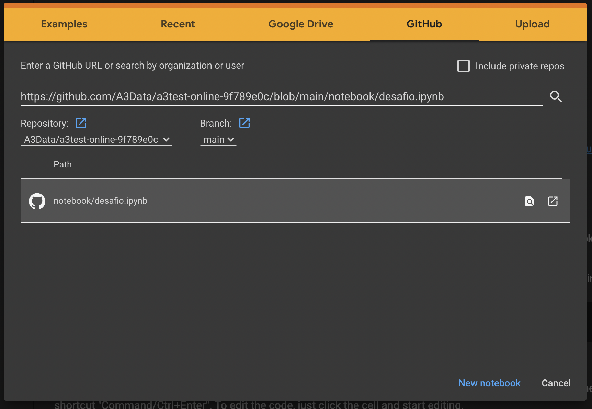

# Olá, seja muito bem-vindo ao desafio de Engenheiro(a) de dados da [A3Data]

  

- Se você chegou até essa etapa meus parabéns, pois você está prestes a se tornar um Eu.A3
- Preparamos esse desafio para realização do seu teste prático de uma das principais linguagens de programação que utilizamos na [A3Data] o **Python**.
- Além disso, vamos fechar com chave de ouro utilizando SQL!

## Você precisará preparar o ambiente no Google Colab para iniciar o desafio técnico.

1. Extraia o arquivo datalake.zip
2. Faça o upload dos arquivos extraidos na raiz do seu Google Drive
3. Acesse o Google colab [https://research.google.com/colaboratory/]
5. Vá até a aba Github e insira a url [https://github.com/A3Data/a3test-online-9f789e0c/blob/main/notebook/desafio.ipynb]
6. Em seguida clique no notebook/desafio e seu setup para o desafio está pronto!

7. Após a conclusão do Desafio exporte o Notebook, e envie por e-mail para o RH da A3Data. 
  - rh@a3data.com.br
